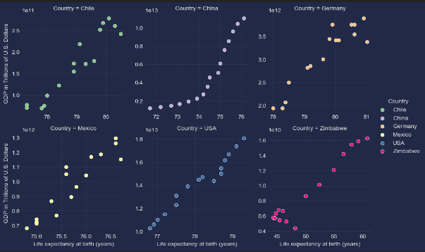

<h1>
  

  
    Analyzing the Interplay between GDP and Life Expectancy 

  

  
     

  

</h1>

#### 🔴*You can Accsess The [Notebook](life_expectancy_gdp.ipynb)*   for full insight on the project.
---
<h1>
  
  Introduction
</h1>
GDP, or Gross Domestic Product, is a measure of the total economic output of a country. It is also often linked to a nations devolepment
This project aims to investigate the presence of a correlation between the Gross Domestic Product (GDP) of six countries and the life expectancy of their respective populations.

The goals are to **prepare data**, **EDA** with ploting, and **share findings** and study the results.

### *Some of the questions this project will seek to answer are:* ❓

- Has GDP increased over the years in all of the 6 nations?
- Has Life Expectancy rates at birth increased over the years in all of the 6 nations?
- Is there a correlation between GDP and Life at birth?
- What is the average Life expectancy in all of the nations?
- what is the average GDP in all of the 6 nations?
- how is the data distributed?

### Data Source:
**GDP Source** :
- [World Bank](https://data.worldbank.org/indicator/NY.GDP.MKTP.CD) national accounts data, and OECD National Accounts data files.

- Life expectancy Data Source:[World Health Organization](http://apps.who.int/gho/data/node.main.688)

 <h1>
  
  Approach
</h1>

<h3>
  ⚙️Tech used for This project :
</h3>

- Loading and cleaning data , EDA:
    - 
    -  
    - `

- Visualizing the Data:
    - 
    - 

# 🔬EDA 
Given a CSV file [all_data.csv] The dataset woule be read and put into a Pandas Dataframe. Then, function as `pd.info()` and `pd.describe()` would be performed to inspect the data and look for any null values.

Some columns were renamed for better and more clear naming , and a couple of plots were graphed to answer our questions and to test the relationship between The GDP rates and The Life expectancy rates across the six nations.

**🫡Please refer to the [Notebook](life_expectancy_gdp.ipynb) To view the project**
# 🔗Findings and Conclusion
the project provides a thorough examination of the relationship between GDP and life expectancy at birth across multiple countries. The combination of statistical analyses, visualizations, and correlation testing contributes to a comprehensive understanding of the interplay between economic factors and health outcomes. These findings can be valuable for policymakers, researchers, and stakeholders interested in the socio-economic determinants of life expectancy.
  

Throughout this project, a CSV file was read and put into a Pandas Dataframe to perform summary statistics and data tidying. After that, several observations were made: 

- According to the given dataset, The GDP and LEABY have increased over the years [2000 - 2015] for all of the six nations. 
- On average, The United States of America had the highest GDP in all of the years while at the same time, the USA was the third highest nation in terms of LEABY following Chille and Germany as the country with the most LEABY.

- a relation was discovered between GDP and The Life Expectancy At Birth rates and the two variables were compared using the '.corr () and the scipy. pearson` coefficient. the result was a 0.34 correlation. 
The positive correlation of 0.34 signifies that as GDP increases, there's a tendency for life expectancy rates to also increase, and vice versa. However, the strength of this relationship is moderate. It's not a weak relationship (which would be closer to zero) nor a strong one (which would be closer to 1

**The presence of a correlation indicates that there is some connection or association between GDP and life expectancy rates. This relationship might be influenced by various factors. For example, higher GDP might lead to better healthcare, education, infrastructure, and living standards, which could contribute to increased life expectancy.**

